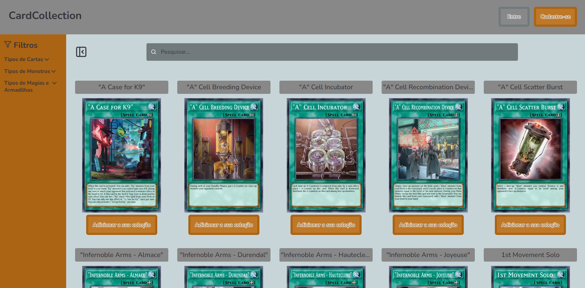
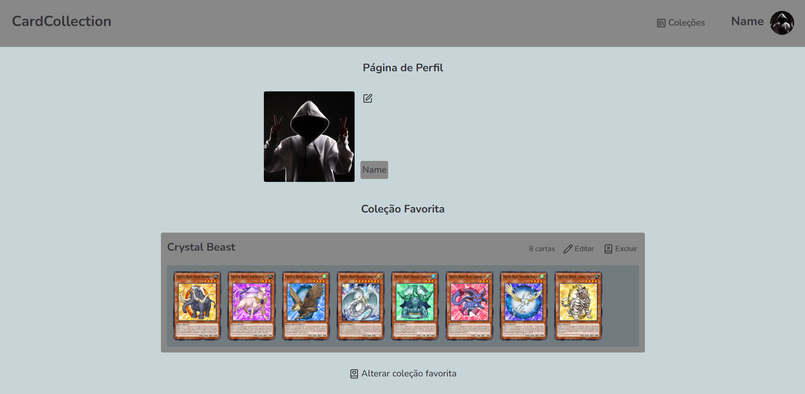
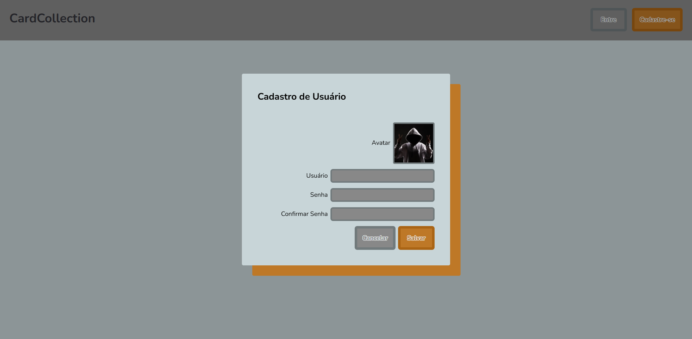

# TCG Collections — Coleções de Cartas TCG

[](https://nextjs.org/)
[](https://react.dev/)
[](https://www.typescriptlang.org/)
[](https://zustand-demo.pmnd.rs/)
[](https://supabase.com/)

Aplicação web para busca e organização de cartas de TCG, com foco inicial em **Yu-Gi-Oh!**.  
É possível criar uma conta, montar coleções personalizadas e marcar uma coleção favorita para exibição no perfil.

---

## ✨ Features

- 🔍 Busca de cartas de Yu-Gi-Oh!
- 🃏 Visualização de cartas em formato de grid
- 📃 Ao clicar na carta, abre um modal/dialog com detalhes completos
- 👤 Sistema de login e cadastro (Supabase Auth)
- 📁 Criação de coleções personalizadas
- ➕ Adicionar cartas diretamente para uma coleção
- ⭐ Escolher uma coleção favorita no perfil
- 💾 Persistência de dados via Supabase
- ⚡ Estado global via Zustand
- 🎨 UI custom com Styled Components
- 🧩 Ícones usando Lucide-React
- 🚀 App em React + Next.js + Typescript

---

## 🧰 Tecnologias

| Área | Tecnologia |
|---|---|
| Framework | Next.js + React |
| Linguagem | Typescript |
| Estado | Zustand |
| Backend as a Service | Supabase |
| Auth | Supabase Auth |
| DB / Storage | Supabase Database + Buckets |
| Estilização | Styled Components |
| Ícones | lucide-react |
| Deploy | (Vercel / outro) |

---

## 🏗 Arquitetura resumida

- **Zustand**
  - gerencia dados do usuário, coleções e cartas
- **Supabase**
  - persistência das coleções
  - relação coleção ↔ carta
  - avatar e imagens via bucket
  - autenticação
- **Styled Components**
  - estilização orientada a componentes
  - tema reutilizável (opcional)
- **Lucide-React**
  - ícones leves e escaláveis

---

## 📦 Como rodar o projeto

```bash
git clone https://github.com/seu-user/card-collection.git
cd card-collection
npm install
npm run dev
```

---

## 🔐 Variáveis de ambiente

Crie um `.env.local` com:

```bash
NEXT_PUBLIC_SUPABASE_URL=
NEXT_PUBLIC_SUPABASE_ANON_KEY=
```

---

## 🖼 Screenshots (opcional)

<p align="center">
  
  
  
  
</p>

---

## 🚧 Roadmap

- [ ] Suporte a mais TCGs além de Yu-Gi-Oh!
- [ ] Filtro avançado de busca
- [ ] Compartilhar perfil com outros usuários
- [ ] Dark/Light Mode

---

## 🤝 Contribuições

Contribuições são bem-vindas!  
Abra uma Issue ou Pull Request.

---

## 📜 Licença

MIT License — veja o arquivo LICENSE para mais detalhes.

---

## 🙋 Sobre o projeto

Projeto criado para estudo de:
- Next.js
- Zustand
- Supabase
- Styled Components
- UX aplicada a TCG
